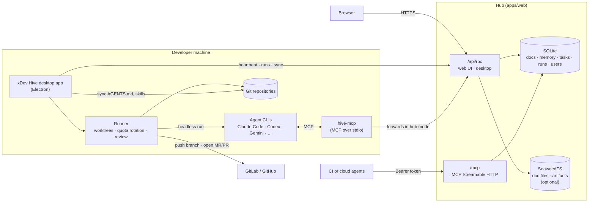
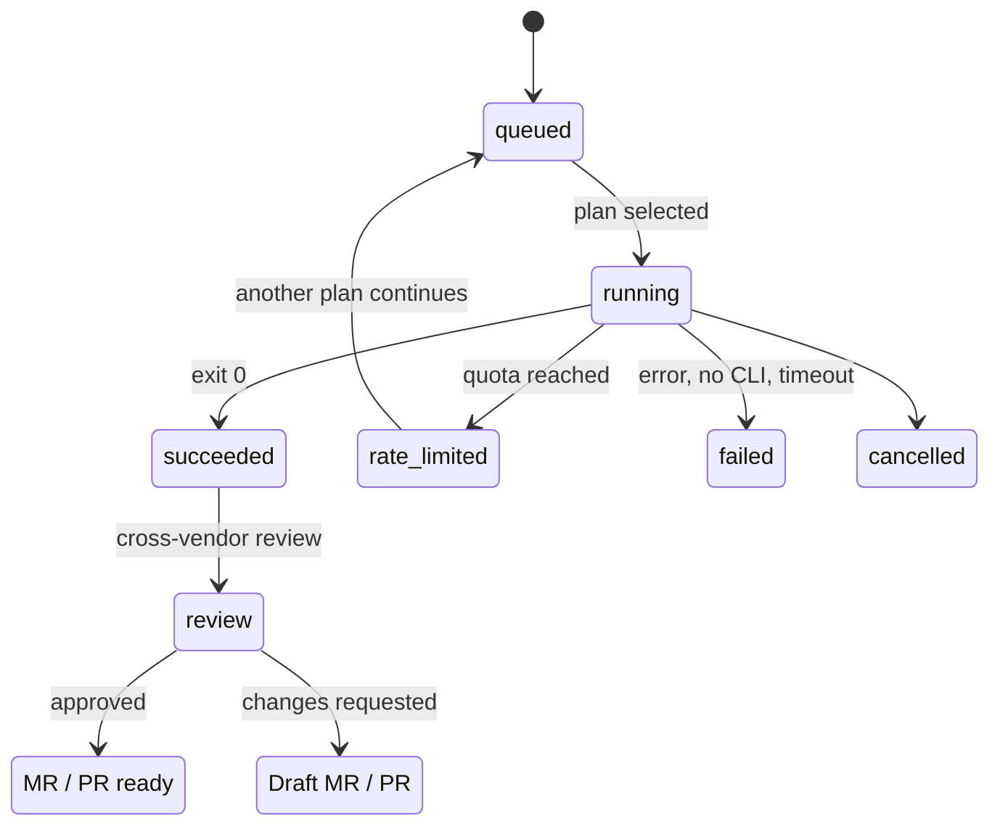

<p align="center">
  <picture>
    <source media="(prefers-color-scheme: dark)" srcset="output/branding/xdev-hive-dark.png">
    
  </picture>
</p>

<h3 align="center">One shared brain for every coding agent on your team.</h3>

<p align="center">
  Docs, memory, tasks and an agent runner for Claude Code, Codex, Gemini CLI and more, over MCP.
</p>

<p align="center">
  <a href="https://github.com/tdduydev/xdev-hive/releases">Download</a> ·
  <a href="#quick-start">Quick start</a> ·
  <a href="#connecting-agents-mcp">Connect agents</a> ·
  <a href="docs/user-guide/en/getting-started.md">User guide</a> ·
  <a href="docs/README.vi.md">Tiếng Việt (full guide)</a>
</p>

---

xDev Hive is a self-hosted hub that gives every coding agent on a team the same context. Agents from different vendors and different subscription plans read the same conventions, search the same memory, claim tasks from the same board, and hand work over to each other, all through the [Model Context Protocol](https://modelcontextprotocol.io).

It comes in two parts:

- **The hub** (`apps/web`): a Node.js/Express server with a web UI, a JSON RPC API and an MCP endpoint over HTTP, backed by SQLite. One hub serves a whole team.
- **The desktop app** (`apps/desktop`): an Electron app for macOS, Windows and Linux. It installs and configures agent CLIs on each machine, keeps repositories in sync with the hub, and runs agents headlessly in isolated git worktrees. It also works on its own, without a hub.

## Contents

- [Features](#features)
- [Architecture](#architecture)
- [Quick start](#quick-start)
- [Installing the desktop app](#installing-the-desktop-app)
- [Connecting agents (MCP)](#connecting-agents-mcp)
- [Configuration](#configuration)
- [Deployment](#deployment)
- [Security](#security)
- [Development](#development)
- [Project structure](#project-structure)
- [CI/CD](#cicd)
- [Documentation](#documentation)
- [Contributing](#contributing)
- [License](#license)

## Features

**Shared knowledge**

- **Versioned docs.** The source of truth for each repository's `AGENTS.md`, team-wide standards (`org/*`) and the decision log, with history and diffs. Docs can be scoped to path globs and are rendered into nested `AGENTS.md` files or Claude Code path rules.
- **Proposals, not direct edits.** Agents call `doc_propose`; a reviewer approves. A proposal made against an outdated version is flagged as a conflict instead of overwriting.
- **Skills.** Team-wide and per-repository `SKILL.md` files. Claude Code loads them from `.claude/skills/`; other agents read them with `skill_get`.
- **Memory.** `memory_write` / `memory_search` with SQLite FTS5 full-text search, plus optional semantic search through any OpenAI-compatible embeddings endpoint (for example Ollama). Agent-written memory can require approval, entries can supersede or contradict each other, and unused entries go stale instead of being deleted.
- **Sync into repositories.** The desktop app renders `AGENTS.md`, `CLAUDE.md` and `docs/decisions.md` into each repository, through a merge request when the remote supports it. A Claude Code hook and a git `pre-commit` hook stop agents from editing those files by hand.

**Coordinated work**

- **Task board.** `task_claim` takes a lease so two agents never pick up the same task; `task_update` records a handoff note, and note history is kept. Tasks can depend on other tasks, including tasks in other services of the same system.
- **Systems and services.** A system groups several repositories (services). Docs and memory can live at system level and are shared by every service in it.
- **Spec Kit workflow.** The *Spec* page tracks [Spec Kit](https://github.com/github/spec-kit) features (`spec.md` → `plan.md` → `tasks.md`), runs each step as an agent run, and imports `tasks.md` into the board.
- **SDLC gates.** Spec, plan, tasks, dispatch, review, fix and merge gates, each set to human approval, AI check or automatic.

**Agent runner (desktop)**

- **Headless runs** with Claude Code, Codex, Gemini CLI, GitHub Copilot CLI, OpenCode, Kilo Code CLI, Mistral Vibe, Antigravity or a custom command. Each task runs in its own worktree on branch `ai/<task>`.
- **Quota rotation.** Each profile is one subscription. When a plan reports its limit, the runner moves to another plan and picks the work up on the same branch.
- **Cross-vendor review and best-of-n.** A finished run is reviewed by a different vendor. Hard tasks can run 2 to 4 variants on different plans, with a judge from another vendor keeping the best.
- **Merge requests and pull requests.** After review, the runner pushes `ai/<task>` and opens a GitLab MR or GitHub PR, watches CI, and can queue a fix run when the pipeline fails.
- **Optional containers.** A profile can run inside Docker with a per-run internal network and an egress proxy that only lets allowed hosts through.

**Team operations (hub)**

- Per-service roles and fine-grained permissions, OpenID Connect single sign-on, and machine tokens bound to user accounts.
- Agent policy (allowed models, autonomy level, network, MCP servers), spend caps, a hub-wide stop switch, and an audit log that records which agent acted for which person in which run.
- Fleet view of machines and plans, cost estimates, alerts, and Microsoft Teams / Slack webhooks.
- Web UI in English and Vietnamese, usable on mobile.

## Architecture



- **Local mode.** The desktop app keeps everything in `~/.xdev-hive/local.db`. Nothing leaves the machine.
- **Hub mode.** The desktop app and `hive-mcp` read and write the hub directly. Each machine signs in with a user account and receives its own token. Agents never see the hub token in their MCP configuration.
- **No native modules in the data layer.** SQLite runs on the `node:sqlite` module built into Node.js 24+ and Electron. The desktop app's only native dependency is `node-pty`, for terminals.

### Run lifecycle



## Quick start

### 1. Run the hub

Requires Docker with Compose.

```bash
git clone https://github.com/tdduydev/xdev-hive.git
cd xdev-hive
docker compose up -d
docker compose logs hub    # prints the one-time setup code
```

Open `http://<this-machine>:7788`. A hub with no accounts shows a **setup page**: enter the setup code, create the admin account, and choose the public hostname, file storage, semantic search, SSO and backup options. The hub saves these to `/data/settings.json` in the data volume (mode `0600`) and restarts.

Optional parts are Compose profiles:

| Profile | Command | What it adds |
|---|---|---|
| `https` | `HIVE_HOSTNAME=hub.example.com docker compose --profile https up -d` | Caddy with automatic HTTPS (needs DNS and ports 80/443) |
| `tunnel` | `TUNNEL_TOKEN=… docker compose --profile tunnel up -d` | Cloudflare Tunnel; point its public hostname at `http://hub:7788` |
| `embed` | `docker compose --profile embed up -d` | Ollama for semantic memory search (embeddings URL `http://ollama:11434/v1`) |

Behind either HTTPS option, tick *behind an HTTPS proxy* on the setup page.

### 2. Install the desktop app on each machine

Download it from [GitHub Releases](https://github.com/tdduydev/xdev-hive/releases) (see [below](#installing-the-desktop-app)). On first launch, the **Get started** page walks through:

1. Signing in to the hub through the browser, or choosing *Use alone on this machine* (local mode).
2. Installing missing agent CLIs and the `hive-mcp` command.
3. Adding repositories. A folder with several repositories is scanned for each one, and a GitLab group can be imported in one go.
4. Writing the agent configuration for each repository (MCP server, hooks).
5. Signing in to at least one agent plan, and in hub mode, turning on *Accept work*.

### 3. Give your agents the protocol

Add a short protocol to each repository's `AGENTS.md` (the hub renders it for you once the repository is synced):

1. At the start of a session, call `memory_search` on the topic of the task.
2. Only work on a task you claimed with `task_claim`, on branch `ai/<task-id>`.
3. Record decisions and gotchas with `memory_write`.
4. Propose doc changes with `doc_propose` instead of editing `AGENTS.md` directly.
5. Finish with `task_update` to `review`, with a handoff note.

## Installing the desktop app

Each release on [GitHub Releases](https://github.com/tdduydev/xdev-hive/releases) ships these files, with a `SHA256SUMS.txt` to verify them:

| Platform | File |
|---|---|
| macOS, Apple Silicon | `xdev-hive-<version>-mac-arm64.dmg` |
| macOS, Intel | `xdev-hive-<version>-mac-x64.dmg` |
| Windows x64 | `xdev-hive-<version>-win-x64-setup.exe` |
| Windows ARM64 | `xdev-hive-<version>-win-arm64-setup.exe` |
| Ubuntu / Debian | `xdev-hive-<version>-linux-amd64.deb`, `xdev-hive-<version>-linux-arm64.deb` |
| Linux (AppImage) | `xdev-hive-<version>-linux-x86_64.AppImage`, `xdev-hive-<version>-linux-arm64.AppImage` |
| Linux, per-user install | `install-linux.sh` with the matching AppImage |

The builds are not signed with Apple or Microsoft certificates yet, so the operating system warns on first launch:

- **macOS**: open *System Settings → Privacy & Security* and click *Open Anyway*.
- **Windows**: in the SmartScreen prompt, click *More info → Run anyway*.
- **Linux, per-user**: `sh install-linux.sh xdev-hive-<version>-linux-x86_64.AppImage` installs into `~/.local/share/xdev-hive` without `sudo` or FUSE, and the app can then update itself.
- **Linux, `.deb`**: `sudo apt install ./xdev-hive-<version>-linux-amd64.deb`.
- **Linux, AppImage**: needs FUSE 2 (`libfuse2`, or `libfuse2t64` on Ubuntu 24.04 and later).

The app also takes updates from the hub, where an admin chooses the version machines receive.

## Connecting agents (MCP)

### Through the desktop app (recommended)

*Agent configuration* in the app writes everything for each repository, merging with your existing settings rather than replacing them:

| Agent | Where the MCP server is registered |
|---|---|
| Claude Code | `~/.claude.json`, local scope of the repository, with the full path to the `hive-mcp` shim |
| Codex | A marked block in `~/.codex/config.toml` |
| Gemini CLI | `.gemini/settings.json`, with `AGENTS.md` as the context file |

The shim lives in `~/.local/bin/hive-mcp` (Windows: `%USERPROFILE%\.xdev-hive\bin\hive-mcp.cmd`) and runs the MCP server with the app's own runtime. In hub mode it forwards to the hub using the machine's credentials, so MCP configuration files never contain a token. Per-OS verification steps are in [docs/mcp-check.md](docs/mcp-check.md).

### Without the desktop app (CI, cloud agents)

Call the hub's MCP endpoint over HTTP with an agent token:

```http
POST https://hub.example.com/mcp
Authorization: Bearer <agent token>
x-hive-agent: <agent name>        (optional)
```

Create the token on the hub's *Tokens* page. An `agent` token can read, work on tasks, propose and write memory, but never approve. A `viewer` token only exposes read tools.

### Main tools

| Area | Tools |
|---|---|
| Memory | `memory_search`, `memory_write` |
| Docs and skills | `doc_list`, `doc_get`, `doc_propose`, `skill_list`, `skill_get`, `skill_propose` |
| Tasks | `task_list`, `task_get`, `task_next`, `task_claim`, `task_update`, `task_notes` |
| Runs and machines (hub mode) | `run_list`, `run_get`, `run_requests`, `machine_list`, `setup_missing` |
| Governance (hub mode) | `cost_summary`, `policy_get`, `alert_list` |
| Run artifacts | `artifact_list`, `artifact_get` |

The tools a caller sees depend on its permissions: read-only callers get only the read tools, and the hub refuses writes from them as well.

## Configuration

The hub reads `HIVE_*` environment variables. With Docker Compose, put them in the environment or a `.env` file next to `compose.yaml`. A variable set this way wins over the setup page, which shows it as locked. To change settings after setup, edit `/data/settings.json` or set the variable, then run `docker compose restart hub`.

| Variable | Default | Description |
|---|---|---|
| `HIVE_PORT` / `HIVE_HOST` | `7788` / `127.0.0.1` (image: `0.0.0.0`) | Listening port and bind address |
| `HIVE_DB` | `apps/web/data/hub.db` (image: `/data/hub.db`) | SQLite database file |
| `HIVE_ALLOWED_HOSTS` | loopback only when bound to loopback | Comma-separated `Host` header allow-list against DNS rebinding. Required with a public hostname or behind a reverse proxy |
| `HIVE_LAN_HOSTS` | – | Extra LAN names and addresses the hub answers to (see `deploy/compose.lan.yaml`) |
| `HIVE_PUBLIC_URL` | `https://` + first allowed host | Base URL used in webhook links and the OIDC redirect URI |
| `HIVE_SETUP` | – (`1` in `compose.yaml`) | With no accounts yet, show the setup page and log a setup code |
| `HIVE_ADMIN_USER` | `admin` | First admin account, created with a temporary password when setup mode is off |
| `HIVE_BOOTSTRAP_TOKEN` | – | Fixed token for automated deployments (at least 32 characters). It belongs to no account, so it acts as a member: it can seed projects but cannot administer (spec 79a) |
| `HIVE_TRUST_PROXY` | off | `1` behind a TLS proxy: `Secure` cookies, client address from `X-Forwarded-For` |
| `HIVE_MEMORY_APPROVAL` | on | `off` makes agent-written memory visible without approval |
| `HIVE_MEMORY_STALE_DAYS` | `90` | Memory unused for this many days is left out of agent searches (`0` = never) |
| `HIVE_RUN_LOG_DAYS` | `30` | Days before a run's log and diff are dropped; the run summary is kept (`0` = keep) |
| `HIVE_ARTIFACT_DAYS` | `30` | Days before a done task's run artifacts are dropped (`0` = keep) |
| `HIVE_RELEASE_KEEP` | `3` | Desktop releases whose builds stay on disk |
| `HIVE_BACKUP_DIR` | off (image: `/data/backups`) | Enables backups: one at startup and then periodically |
| `HIVE_BACKUP_HOURS` / `HIVE_BACKUP_KEEP` | `24` / `7` | Backup interval and number of unpinned snapshots kept |
| `HIVE_BACKUP_PIN_DAYS` / `HIVE_BACKUP_PIN_MAX_MB` | `180` / `20480` | Retention and size cap for pinned snapshots |
| `HIVE_EMBED_URL` | off | OpenAI-compatible `/embeddings` endpoint for semantic memory search |
| `HIVE_EMBED_MODEL` / `HIVE_EMBED_KEY` | `bge-m3` / – | Embedding model, and Bearer key for an external API |
| `HIVE_EMBED_MIN_SCORE` | `0.5` | Minimum cosine similarity for a semantic match |
| `HIVE_OIDC_ISSUER` / `HIVE_OIDC_CLIENT_ID` / `HIVE_OIDC_CLIENT_SECRET` | off | OpenID Connect sign-in; all three are required |
| `HIVE_OIDC_NAME` / `HIVE_OIDC_SCOPES` | `SSO` / `openid profile email` | Sign-in button label and requested scopes |
| `HIVE_SEAWEEDFS_URL` / `HIVE_SEAWEEDFS_PREFIX` | off / `/xdev-hive/doc-files` | Store doc files and run artifacts in a SeaweedFS filer instead of the database |
| `HIVE_REMOTE_TERMINAL` | off | `1` enables the remote terminal; each machine still opts in locally |
| `HIVE_GATE_JOBS` | off | `1` enables gate jobs; each machine still declares its own templates |
| `HIVE_LOG_REPEAT_THRESHOLD` | `10` | Repeats of the same error within an hour before an alert opens |

`compose.yaml` also reads `HIVE_HTTP_BIND` and `HIVE_HTTP_PORT` (default `0.0.0.0:7788`) for the published port, and `HIVE_SEAWEEDFS_IMAGE` / `HIVE_CADDY_IMAGE` to override the SeaweedFS and Caddy images (by default the ones rebuilt with a current Go and scanned by `.github/workflows/deps-images.yml`).

## Deployment

| File | Use |
|---|---|
| [`compose.yaml`](compose.yaml) | Recommended. Hub + SeaweedFS, with optional `https`, `tunnel` and `embed` profiles and the setup page |
| [`Dockerfile`](Dockerfile) | Hub-only image (no desktop code). Runs as user `node`, stores data in `/data`, has a `HEALTHCHECK` on `/api/health` |
| [`deploy/compose.yaml`](deploy/compose.yaml) | Older layout: hub + Caddy, configured only through `deploy/.env` (no setup page) |
| [`deploy/compose.tunnel.yaml`](deploy/compose.tunnel.yaml) | Overlay for a host that already runs `cloudflared` |
| [`deploy/compose.lan.yaml`](deploy/compose.lan.yaml) | Overlay that adds a plain-HTTP port for machines on the local network |
| [`deploy/update.sh`](deploy/update.sh) | Pulls `origin/main`, rebuilds and waits for the hub to become healthy. Set `HIVE_TUNNEL=1` and/or `HIVE_LAN=1` to match the overlays in use, every time |
| [`deploy/restore-drill.sh`](deploy/restore-drill.sh) | Restores the latest backup into a throwaway hub and verifies every stored file by SHA-256 |

Things to know:

- **Run one hub container per database.** SQLite does not share a file between replicas.
- **Backups** use `VACUUM INTO`, so they are safe while the hub runs. Do not copy `hub.db` directly. For an immediate backup, run `npm run backup -w @xdev-hive/web -- [dir] [keep]`.
- **The LAN port is unencrypted.** Only enable it on a trusted network, and restrict it to the LAN interface and address range.
- **Lost the admin password?** In a checkout of the repo on the server, run the commands below. The hub image has no npm, so inside the container call the same CLI with node: `docker compose exec -w /app/apps/web hub node src/cli.ts user reset admin` (and `user list`, `token create ci-bot agent`).

  ```bash
  npm run user -w @xdev-hive/web -- reset admin
  npm run user -w @xdev-hive/web -- list
  npm run token -w @xdev-hive/web -- create ci-bot agent
  ```

Running without Docker:

```bash
npm ci && npm run build -w @xdev-hive/web
HIVE_HOST=0.0.0.0 HIVE_ALLOWED_HOSTS=hub.example.com HIVE_DB=/data/hub.db \
  HIVE_BACKUP_DIR=/data/backups npm run start -w @xdev-hive/web
```

Detailed operations (LAN port hardening, SSO setup, SeaweedFS, restore procedures, multi-machine behaviour) are in the [Vietnamese guide](docs/README.vi.md#hub-cho-team).

## Security

- **Passwords** are hashed with scrypt and a per-user salt, compared in constant time. Five failures lock an IP and username pair for 15 minutes.
- **Sessions** use `HttpOnly`, `SameSite=Strict` cookies (`Secure` behind TLS), stored as SHA-256 on the hub. Cookie-authenticated writes require a CSRF header and a matching `Origin`.
- **Tokens** are stored only as SHA-256 and shown once. The MCP endpoint accepts tokens, never cookies.
- **Secret scanning.** Docs, proposals and memory that contain strings that look like secrets (cloud keys, Git forge tokens, `sk-…`, JWTs, private keys, hub tokens) are rejected.
- **Hidden characters.** Content with bidirectional overrides, tag characters or zero-width characters is rejected, because it can make what a reviewer sees differ from what a model reads.
- **Write provenance.** Every doc version, proposal and memory entry records its channel (web, desktop, MCP, API), plus machine, run and task for agents.
- **Desktop hardening.** `contextIsolation` and `sandbox` are on, the preload exposes only the functions the UI needs, IPC checks the sender, and production builds set a CSP. `~/.xdev-hive/config.json` is written with mode `0600`.
- **Runs do not execute repository configuration.** Claude Code runs start with hooks disabled and only app-generated MCP servers, because an agent could otherwise plant hooks that the next run would execute.
- **Read-only profiles** (`HIVE_READONLY=1`) guard against accidental writes and prompt injection. They are not a security boundary: an agent running as the same OS user can still read the machine's credentials.

Please report vulnerabilities privately to the maintainers rather than in a public issue.

## Development

Requirements: Node.js 24 or later (`.nvmrc` pins the version used locally) and npm.

```bash
nvm use
npm ci
npm run typecheck
npm test
```

| Task | Command |
|---|---|
| Hub with live reload | `npm run dev:web`, then open `http://localhost:7788` (the first run prints a temporary `admin` password; delete `apps/web/data/` to reset) |
| Desktop app | `npm run dev:desktop` |
| Desktop end-to-end smoke | `npm run build -w @xdev-hive/desktop` then `npm run smoke -w @xdev-hive/desktop -- <screenshot dir>` |
| Web end-to-end (desktop and mobile viewports) | `npm run e2e -w @xdev-hive/web -- <screenshot dir>` and `npm run e2e:mobile -w @xdev-hive/web -- <screenshot dir>` |
| Run selected e2e steps | add `--only <step>[,<step>…]`, and `--repeat N` to repeat on a fresh hub each time |
| Installer for this machine | `npm run dist -w @xdev-hive/desktop` |
| Code graph index for agents | `npm run codegraph:init` |

The e2e suites build the client, start a throwaway hub, and drive it with Electron as a headless browser, saving one screenshot per step (failing steps get a `-FAIL` suffix). On headless Linux, wrap them in `xvfb-run` with `ELECTRON_DISABLE_SANDBOX=1`.

**Before opening a pull request**, run `npm run typecheck` and `npm test`. If you changed the desktop UI, also run the desktop build and smoke test; if you changed the web UI, also run both e2e suites.

**Code conventions**

- Cross-folder imports use the package alias (`#ui/`, `#core/`, `#web/`, `#desktop/`, `#mcp/`), declared as Node subpath imports in each `package.json`, never `../`.
- UI strings go into `packages/ui-kit/src/i18n/locales/vi.ts` (the source catalog) and `en.ts`. TypeScript and `npm test` catch missing keys and placeholders.
- Colors, type and spacing come from the design tokens in `packages/ui-kit/src/tokens/`.
- Comments explain *why*, not *what*.

## Project structure

```text
xdev-hive/
├── apps/
│   ├── web/          Hub: Express server, JSON RPC, MCP over HTTP, accounts, React client
│   └── desktop/      Electron app: tray, setup, repo sync, runner, GitLab/GitHub integration
├── packages/
│   ├── core/         Zod schemas, permissions, SQLite store (node:sqlite + FTS5), hub client, sync rendering
│   ├── mcp/          MCP server and the `hive-mcp` stdio entry point
│   ├── ui/           Shared React pages and shell for the hub and the desktop app
│   └── ui-kit/       Components (shadcn/ui + Tailwind CSS v4), i18n catalogs, design tokens
├── deploy/           Compose overlays, Caddy configs, update and restore-drill scripts
├── docker/agent/     Image and egress proxy for running agents in containers
├── docs/             Roadmap, goals, specs, design references, Vietnamese guide
├── scripts/          Repository tooling (review batches, perf audit, tests)
├── compose.yaml      One-command hub deployment
└── Dockerfile        Hub image
```

## CI/CD

| Workflow | Trigger | What it does |
|---|---|---|
| [`ci.yml`](.github/workflows/ci.yml) | Pull requests and pushes to `main` | `npm ci`, `npm run typecheck`, `npm test` on Ubuntu with Node.js 24 |
| [`release.yml`](.github/workflows/release.yml) | Tags `v*`, or manual dispatch (dry run by default) | Builds the desktop app for macOS, Windows and Linux on a macOS runner and publishes a GitHub Release |

Releases can also be cut by hand with `npm run release -w @xdev-hive/desktop` from a clean checkout of `origin/main` (`-- --dry` builds without publishing, `-- --linux-only` builds natively on Linux). Bump `version` in `apps/desktop/package.json` first.

## Documentation

| Document | Contents |
|---|---|
| [User guide (English)](docs/user-guide/en/getting-started.md) · [Hướng dẫn (Tiếng Việt)](docs/user-guide/vi/getting-started.md) | Using the hub and the desktop app step by step: getting started, tasks and runs, leader chat, docs and memory, agents and quota, administration |
| [Feature list](docs/user-guide/en/features.md) · [Danh sách tính năng](docs/user-guide/vi/features.md) | Every feature by area, and where to find it in the interface |
| [docs/README.vi.md](docs/README.vi.md) | Full Vietnamese guide: every feature, runner behaviour, GitLab/GitHub, hub operations, permissions, SSO, backups |
| [docs/roadmap.md](docs/roadmap.md) | Roadmap and completed items |
| [docs/goals.md](docs/goals.md) | Remaining work, order and completion criteria |
| [docs/specs/](docs/specs/) | Feature specifications |
| [docs/mcp-check.md](docs/mcp-check.md) | Verifying the MCP setup on each operating system |
| [output/branding/brand-notes.md](output/branding/brand-notes.md) | Logo, colors and usage |

Most project documentation is written in Vietnamese.

## Contributing

1. Pick or create a task on the hub and claim it, then work on a branch named `ai/<task-id>`.
2. Follow the conventions in [AGENTS.md](AGENTS.md). Propose changes to `AGENTS.md`, `CLAUDE.md` and `docs/decisions.md` through the hub (`doc_propose`) instead of editing them; they are generated.
3. Run the checks listed under [Development](#development), then open a pull request against `main`. CI must pass.
4. When a roadmap item is complete, bump the desktop `version` and tick the item in `docs/roadmap.md`.

## License

This repository does not include a license file. All rights are reserved by the authors unless a license is added.
