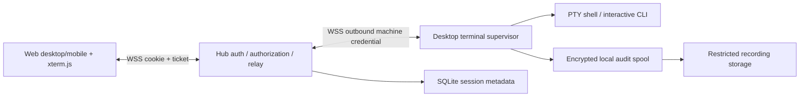

# 69. Terminal từ xa và phiên vận hành trên web Hive

Trạng thái: **đề xuất để review**, chưa triển khai. Task nghiên cứu `RES-remote-terminal`, 2026-10-07. Không đổi version/roadmap trong task này.

## 1. Quyết định và phạm vi

Chọn **(a) PTY trên máy, WebSocket qua hub, xterm.js trên web** làm nền cho thao tác trực tiếp của admin/chủ máy. Bổ sung (d) gate job có lệnh cố định để kiểm GUI và dùng lại (c) auto-release 60c cho luồng lặp lại. Không biến `runs.dispatch` thành đường mở shell đầy quyền, không tự nâng sandbox của run hiện có.

MVP phục vụ macOS và Linux: mở shell của OS user đang chạy app/helper, chọn project và checkout, chạy CLI tương tác, resize, Ctrl-C, nối lại, đóng/thu hồi, audit. Windows/ConPTY là bước sau, báo unsupported rõ ràng. “Đầy quyền” là quyền OS user cùng credential local đã cấu hình, **không mặc nhiên root, sudo, quyền Git hoặc quyền production**. Terminal không phải remote desktop: Electron mở trên màn hình/session GUI của máy; web nhận log và artifact.

Hai loại không được nhập nhằng:

- **Terminal do người điều khiển**: người có quyền mở và gõ trực tiếp; có thể tự chạy Claude/Codex như ở máy. Không có lời hứa duyệt từng command của CLI đó. Khi mở phải xác nhận quyền OS rộng và phạm vi audit.
- **Operator session có duyệt từng hành động của agent**: lộ trình riêng 69i, chỉ bật sau khi adapter chặn được mọi đường thực thi. Một prompt “hãy hỏi trước” hoặc phân tích dòng Enter trong PTY không phải chốt bảo mật. Không phát hành chế độ này với cờ bypass rồi gắn nhãn “được bảo vệ”.

Yêu cầu “toàn bộ phiên, lệnh gì” được hiểu là timeline I/O có che nội dung nhạy cảm và các hành động quản trị. PTY không chứng minh mọi syscall/subcommand đã chạy; shell history cũng không phải audit tin cậy. Yêu cầu “không có bất kỳ secret nào trong bất kỳ transcript nào” không thể bảo đảm với shell tùy ý (người có thể in secret chưa biết hoặc encode nó). Đây là giới hạn cần người review chấp nhận trước khi bật terminal tự do; nếu cần bảo đảm cứng, chỉ bật gate/release job với output schema cố định, không bật shell.

## 2. Nền đã rà và phần dùng lại

Đã thử `git merge --ff-only ai/INT-0144d`; sandbox từ chối ghi `ORIG_HEAD.lock` trong Git common directory. Theo chỉ dẫn, đọc bằng `git show ai/INT-0144d:<path>` và `git grep` trên nhánh. Nền nghiên cứu: `085a2427aff82cdeb86623fd07a8602a5d030ec8`; worktree vẫn ở nền `0695fc7b93`. Không coi tình trạng nền cũ trong worktree là thiếu implementation trên nhánh tích hợp.

| Bằng chứng trong nền tích hợp | Hiện có / dùng lại | Còn thiếu cho 69 |
|---|---|---|
| `apps/desktop/src/main/terminal.ts` | `TerminalCommand`, quote OS, cwd, env không secret; ghi script 0700 và mở Terminal/cmd/Linux terminal | Không có PTY, stream, remote auth, reconnect. Giữ đường local; không dùng script chứa token cho remote |
| [32-open-cli-web-prompt.md](32-open-cli-web-prompt.md) | 32a mở CLI trong repo, env account/profile; 32b prompt tạo task/run headless | Web prompt không phải CLI tương tác. 32a không áp 27a vì người ngồi máy; không sao chép ngoại lệ ấy sang API remote |
| [27a-agent-policy.md](27a-agent-policy.md), `packages/core/src/agent-policy.ts`, `runner/command.ts` | Policy hub → project → profile chỉ siết; `applyAutonomy`, `policyBlocks`, env/login và MCP theo run | Remote session có policy/credential riêng; không thay global autonomy |
| `command.ts` / `agent-policy.ts` | Codex edit dùng workspace-write, full dùng danger-full-access; profile legacy full-auto được normalize. Network restricted cần container; Claude có permission modes | CLI approval khác OS sandbox. Network access không sửa macOS launchservicesd. Không lấy args headless làm args tương tác |
| [60-autopilot.md](60-autopilot.md), [60c-auto-release-contract.md](60c-auto-release-contract.md), `runner/auto-release.ts` | Worker riêng spawn argv local, clone sạch theo SHA, prepare/release/deploy/checkLogs, receipt bền vững; không nằm trong CLI sandbox | Cần cấu hình máy/secret và kiểm end-to-end thực tế; không cần viết một release engine mới |
| `runner/merge-queue.ts`, `runner.ts`, `packages/core/src/methods.ts` | gateRunner, releaseMachine, pause, merge finish tạo green; worker chỉ lấy khi rảnh, điều phối với merge queue | 69 phải tham gia cùng resource lock, không chạy song song release/merge trên cùng project |
| `apps/web/src/app.ts`, `tokens.ts`, `packages/core/src/sqlite.ts` | Cookie human, CSRF, OIDC/password; run/MCP credential riêng hash+expiry+parent revoke; source headers chỉ metadata | Chưa có human step-up dành cho terminal hay WS terminal; phải thêm server principal phân loại cookie/bearer |
| Memory #846, #843, #847 / SEC-mcp-cred | Run gắn project/task/run/machine, RPC agent allowlist; MCP thủ công đổi credential; prefix secret được redact | Không cấp token máy/admin cho process terminal/agent; không cho `hiverun_`/`hivemcp_` gọi terminal control |
| Memory #956, #950, #985 | Electron ngoài sandbox chạy; Codex Seatbelt chặn launchservicesd; Claude trên cùng macmini từng chạy được | Helper phải khởi động từ app/OS session ngoài run sandbox. Không hứa PTY tự chữa GUI hoặc TCC |
| Memory #989, #990 / BUG-assign-claim | Bản cũ nhận diện máy sai khi thiếu source; sửa fallback nhận diện và chặn dispatch sang máy khác | Kiểm bản cài Linux trước rollout. Không coi terminal là cách bỏ kiểm assignment; terminal bind máy từ credential đã xác thực, không parse label |

Các memory là bằng chứng lịch sử, không chứng minh máy đang chạy hiện đã nâng bản. Kiểm tra version/capability thực tế trước mỗi pilot. `autoRelease.*` là code đã có trên nhánh tích hợp, không chỉ là ý tưởng 60c.

## 3. So sánh hướng

Ước lượng dưới đây là dự toán kỹ thuật, một run = một phần build/review có test; không phải giá vendor hay cam kết thời gian. Chi phí vận hành phụ thuộc băng thông, retention, máy và subscription CLI đang dùng.

| Hướng | Ưu điểm | Nhược / bảo mật | Độ khó và chi phí dự kiến |
|---|---|---|---|
| (a) PTY + WS + xterm.js | Đúng CLI/TUI, shell/Git/SSH bất kỳ, mobile, dùng credential có sẵn trên máy | Quyền rộng; auth/revoke/recording bắt buộc; project chỉ là authorization context nếu cùng OS user | Cao, khoảng 8–10 run nền+pilot; không tốn token AI cho shell, có lưu trữ và bandwidth |
| (b) Operator Claude/Codex không sandbox, duyệt từng lệnh nguy hiểm | Người ra mục tiêu và xem/duyệt hành động, ít gõ mobile | Agent có shell unrestricted có thể né classifier; hook/plugin/MCP/compound shell và background process phá bảo đảm; prompt injection | Rất cao, thêm ít nhất 2 run spike/contract rồi mới ước lượng build; thêm token/quota CLI và bảo trì theo phiên bản |
| (c) Hoàn thiện 60c | Repeatable, SHA/receipt/idempotency, rollout; secret local, không cần ngồi terminal | Chỉ workflow cấu hình; lỗi cần đối soát; script từ repo vẫn có quyền máy | Thấp–vừa nhờ code sẵn, 2 run audit/cấu hình+pilot; ít AI, dùng máy release và artifact storage |
| (d) Gate runner ngoài sandbox | Giải quyết e2e/GUI theo SHA, bằng chứng có cấu trúc; không cần shell agent đầy quyền | Test repo là code thực thi, phải trusted; GUI cần session OS thật, quyền local | Vừa, 2 run contract+executor; tốn máy GUI, runtime test và ảnh |

Chọn (a) vì yêu cầu gồm thao tác tương tác ngoài workflow release. (c) là đường chuẩn khi đã ổn định, không thay bằng shell chạy lại cùng version. (d) tránh buộc mọi agent có quyền production chỉ để kiểm UI. (b) không phải MVP.

## 4. Tham khảo hệ thống khác

Nguồn chính thức đã đọc ngày 2026-10-07; đây là bài học thiết kế, không khẳng định Hive có sẵn các bảo đảm của sản phẩm đó.

| Hệ thống / nguồn | Điều áp dụng cho Hive |
|---|---|
| [VS Code Remote Tunnels](https://code.visualstudio.com/docs/remote/tunnels) | Kết nối tới máy remote qua tunnel, không cần public inbound port tại máy. Chọn kết nối outbound từ máy về hub; không triển khai cả IDE |
| [GitHub Codespaces security](https://docs.github.com/en/codespaces/reference/security-in-github-codespaces) | Secret có thể vào terminal qua env; code cấu hình workspace cũng thực thi. Cloud workspace không thay được macmini/credential GUI local |
| [ttyd](https://github.com/tsl0922/ttyd) | Có writable opt-in, kiểm Origin, terminal Unicode/IME. Mượn mô hình PTY, không public một ttyd port và coi basic auth là đủ |
| [GoTTY](https://github.com/yudai/gotty) | Web hoá một command, hỗ trợ bật input/auth/TLS. Hợp demo local hơn quản trị đa máy/project có audit và revoke của Hive |
| [Tailscale SSH](https://tailscale.com/docs/features/tailscale-ssh), [recording](https://tailscale.com/docs/features/tailscale-ssh/tailscale-ssh-session-recording) | Check mode là mẫu step-up; quyền truy cập và recorder là các lớp riêng. Không bắt điện thoại cài VPN để dùng Hive |
| [Coder workspace access](https://coder.com/docs/user-guides/workspace-access) | Web terminal dùng xterm.js + WS, persistent sessions và Unicode; hợp UX reconnect. Không cần đưa cả hệ quản lý workspace Coder vào Hive |
| [Teleport session recording](https://goteleport.com/docs/reference/architecture/session-recording/) | Recording ở node/proxy có tradeoff trust; synchronous recording có thể đóng khi ghi lỗi. Hive chọn ghi tại máy và fail closed khi audit không ghi được |
| [Cloudflare WebSockets](https://developers.cloudflare.com/network/websockets/) | Edge restart/idle có thể cắt WS; cần heartbeat và reconnect, không coi socket là vòng đời process |

## 5. Kiến trúc và ranh giới tin cậy



Helper là process của desktop/OS user, khởi động ngoài sandbox của coding run. Không chạy trong Electron renderer; không mở server inbound trên máy. Hub relay tách control khỏi data nhưng cùng version protocol. MVP một hub process; nhiều replica sau này cần session routing/shared revocation, chưa hứa HA.

Máy opt-in **local** `remoteTerminal.enabled=false` mặc định, danh sách project cho phép, OS user, maxSessions=1 và expiry tối đa. Hub không được tự bật thay máy. Hub admin cũng phải chịu opt-in này. Heartbeat chỉ báo capability `{protocol:1, enabled, projects, platforms, auditReady, guiReady}`; máy cũ thiếu capability → ẩn hành động hoặc báo cần nâng bản.

Machine owner lấy từ quan hệ account/token phía server (tham khảo `machines.approveTool`), không lấy `owner` hay machine label client gửi. Token máy có thể mở relay cho đúng máy nhưng không thể tạo phiên. Chủ máy không có quyền project vẫn bị từ chối. Account bị khoá, mất grant, logout/thu hồi session, parent token máy bị revoke, project archive hoặc local opt-out đều đóng phiên.

MVP shell có quyền cùng OS user nên cwd/project allowlist **không phải filesystem isolation**. Muốn bảo vệ project A khỏi B phải chạy bằng OS account/VM riêng với credential riêng; không hứa chroot bằng kiểm cwd. Máy/hub/browser và người có quyền OS là trusted computing base. Hub relay thấy I/O trong RAM; TLS không phải end-to-end khỏi hub. Giai đoạn sau có thể thêm E2EE, nhưng không ghi rằng MVP đã có.

## 6. Quyền, step-up và vòng đời

`canOpen = humanCookie && activeAccount && (hubAdmin || machineOwner) && projectAccess && machineOptIn && localProjectAllowed && freshStepUp`.

- Human cookie được xác định từ authentication middleware; không tin `x-hive-source=desktop`, role tự khai hoặc bearer admin. Run/MCP/chat grant và machine bearer bị chặn mọi create/attach/approve/replay, kể cả biết session ID. Core RPC giữ kiểm tra actor purpose, không chỉ ở HTTP/UI.
- Thêm `POST /api/terminal/step-up` với CSRF/Origin cùng hub. Password account xác minh lại password bằng cơ chế sign-in có rate limit; OIDC yêu cầu reauthentication có `auth_time` mới (max_age=0 và xác minh claim), không chấp nhận redirect SSO im lặng. Provider không chứng minh được freshness → terminal unavailable, không fallback token. TTL proof 5 phút, dùng một lần khi tạo/reattach, bind user+browser session+machine+project+operation. Không lưu password/token plaintext.
- Mở form xác nhận máy, OS user, project, checkout, “Quyền của tài khoản trên máy”, retention và lý do (tối đa 500 ký tự đã lọc secret). Giới hạn đường dẫn chỉ chọn repo/worktree được máy resolve realpath; client không gửi shell string hoặc env tùy ý vào create.
- Mỗi session chỉ một writer. Tab thứ hai không tự chiếm; cùng chủ phiên phải step-up và bấm “Chuyển điều khiển”, tăng writerEpoch, chặn input epoch cũ. Admin/chủ máy khác được terminate, không tự attach vào phiên người khác; muốn thao tác mở phiên mới sau đóng phiên cũ.
- Idle input 15 phút (output/ping không reset); absolute TTL 2 giờ. UI báo trước 60 giây. Gia hạn cần step-up mới, không vượt trần local/hub; tối đa 8 giờ cho cấu hình được admin duyệt. Phiên chưa attach hết hạn sau 60 giây.
- Browser mất mạng: giữ session tối đa 5 phút, dừng nhận input; khi nối lại phải kiểm quyền và step-up mới. Không buffer gõ/paste offline rồi tự gửi lại. Reconnect không chạy lại command.
- Hub–máy: lease quyền 30 giây, renew mỗi 10 giây; mất hub thì không nhận input và kill process khi hết lease. Revoke online: hub chặn input ngay, máy nhận kill mục tiêu ≤2 giây. Partition không thể bảo đảm “ngay lập tức”; bound ≤30 giây nhờ lease monotonic. Local emergency stop có hiệu lực không cần hub.
- SIGTERM process group, sau 5 giây SIGKILL; dùng `killTree` hiện có nơi phù hợp. Process thoát group, daemon và remote SSH command có thể sống tiếp: ghi `cleanupUncertain`, yêu cầu đối soát. Không khẳng định revoke hoàn tác push/deploy đã thực hiện. Gate/release job dùng receipt/reconcile riêng cho việc dài.

Trạng thái: `requested → starting → active ↔ detached → closing → closed`; nhánh lỗi `expired | revoked | failed`. Transition có version CAS và reason enum, audit bền vững trước spawn/input. Supervisor restart đánh dấu orphan/failed, kiểm và dừng process còn lại; không tự tạo lại PTY hay replay input. Hub restart giữ metadata, cho supervisor reconcile trong lease; nếu hết hạn thì đóng.

## 7. RPC và giao thức đề xuất (v1, chưa tồn tại)

Thêm schema/types ở core; HTTP/WS adapters ở web; supervisor ở desktop. Tất cả ref phải kiểm project/machine/session server-side, không chỉ role trong bảng METHODS. Input dữ liệu PTY không đi qua MCP hoặc `runs.push`.

| Method / endpoint | Input chính → output | Ai được gọi |
|---|---|---|
| `terminal.capabilities` | `{project,machineId}` → capability + reason codes | Human có projectAccess và admin/chủ máy |
| `terminal.create` | `{project,machineId,checkoutRef,mode:'shell',stepUpId,reason,idempotencyKey}` → `{sessionId,state,expiresAt}` | `canOpen`; scope immutable |
| `terminal.list/get` | `{project,sessionId?}` → metadata, không I/O | Admin/chủ máy có projectAccess; creator thấy phiên mình |
| `terminal.attach` | `{sessionId,stepUpId,lastOutputSeq,takeControl?}` → ticket + epoch | Creator còn đầy đủ quyền; kiểm writer |
| `terminal.terminate` | `{sessionId,reason}` → closing/closed | Creator, admin hoặc chủ máy có projectAccess; không yêu cầu step-up để emergency stop |
| `terminal.recording` | `{sessionId,stepUpId,cursor}` → trang transcript redacted | Creator/admin/chủ máy + projectAccess; ghi audit mỗi lần xem/export |
| `terminal.machineReport` | `{sessionId,epoch,state,exitCode?,auditSeq,cleanupUncertain?}` → ACK | Machine credential bind đúng session.machineId; idempotent |
| `POST /api/terminal/step-up` | challenge/reauth → proof một lần | Human cookie + CSRF, rate limited |
| `GET /api/terminal/socket` (upgrade) | cookie, Origin, `hive-terminal.v1` | Authenticate trong upgrade; frame đầu ticket, hạn 5 giây |
| `GET /api/terminal/machine-socket` | Authorization machine bearer, protocol v1 | TokenStore kiểm parent và machine binding; không accept browser cookie |

Ticket ngẫu nhiên 256-bit, hash lưu hub, TTL 30 giây, single-use, bind session/user/browser/epoch. Không query string, không localStorage, không log headers/body. Reconnect lấy ticket mới; cookie và Origin vẫn bắt buộc. Proof/ticket không truyền vào PTY. Machine control envelope `{sessionId,project,machineId,epoch,leaseExpiresAt,policyVersion}` được nhận qua relay đã xác thực; local supervisor tự kiểm opt-in/cwd/TTL lần nữa.

WS frames sau auth là JSON có version/type/epoch/seq; data bytes base64 để không phá UTF-8 khi chia chunk (xterm nhận Uint8Array):

```ts
type ClientFrame =
  | { type: 'input'; epoch: number; inputSeq: number; data: string }
  | { type: 'resize'; epoch: number; cols: number; rows: number }
  | { type: 'ack'; outputSeq: number }
  | { type: 'ping'; nonce: string };
type ServerFrame =
  | { type: 'output'; epoch: number; outputSeq: number; data: string }
  | { type: 'inputAck'; inputSeq: number }
  | { type: 'state'; state: string; reason?: string }
  | { type: 'gap'; firstAvailableSeq: number }
  | { type: 'pong'; nonce: string };
```

Input frame ≤16 KiB decoded, output ≤32 KiB, resize 20–400 cols/5–200 rows. Per-session input 64 KiB/s, output 1 MiB/s burst 4 MiB, cấu hình trần hub. ACK input chỉ sau supervisor đã ghi audit và chuyển vào PTY; dedup theo epoch+seq trong lifetime supervisor. Mất ACK không retry input tự động (không hứa exactly-once khi crash giữa write/ACK). Input cũ/future/gap sai protocol → reject và audit metadata.

Giữ output replay ring 4 MiB tối đa 5 phút tại máy, chỉ RAM; audit spool riêng. Reconnect gửi lastOutputSeq, chỉ replay output, không spawn lại. Buffer đã vượt → gap banner và reset màn hình/resize để app redraw; không giả transcript đầy đủ. Backpressure high-water 1 MiB/unacked và cap 4 MiB: pause PTY read nếu adapter hỗ trợ, quá 10 giây đóng slow consumer; recorder vẫn ghi có quota, tuyệt đối không OOM. Heartbeat ứng dụng 15 giây, timeout 45 giây; lease bảo mật 30 giây vẫn độc lập.

## 8. Audit và secret

Metadata: sessionId, actor account/browser session ID (không cookie), project, machine, OS user, checkout ref/SHA, openedAt/closedAt, auth freshness, scope/policy version, writer transfers, resize, input/output sequence, exit/revoke reason. Action structured như release/gate lưu argv template ID + hash/version + kết quả, không env values.

Ghi timeline tại supervisor trước khi thực thi input; timestamp + sequence + hash chain, upload theo chunk idempotent và checksum. Quota 100 MiB/phiên, giữ 30 ngày mặc định; thiếu disk/crypto/recorder → từ chối mở hoặc terminate, không silently bỏ recording. Hub audit metadata chỉ giữ reason enum và count/hash, không terminal text. Recording store riêng, mã hóa at rest bằng key ngoài DB, ACL giống §7, không search index, không artifacts tự động, không đẩy vào chat/memory/error telemetry. Purge cả replica/backup theo retention đã công bố; hash chain chỉ phát hiện thay đổi so với anchor đã gửi hub, không chống được máy/root đã bị chiếm.

Hai lớp: (1) archive timeline mã hóa trước khi ghi đĩa, có thể chứa nội dung nhạy cảm chưa nhận diện; không gọi nó “log sạch secret”; (2) transcript dùng để xem/export chỉ là bản redacted. MVP không có tải raw archive hay replay raw lên web; đường truy cập raw local thuộc quản trị OS ngoài Hive. Known secrets lọc tại máy trước upload/display/log, bao gồm prefix Hive và secret env của profile; filter stateful giữ phần đuôi giữa chunk, xử lý ANSI và chuỗi UTF-8 phân mảnh. Không log stdin khi PTY tắt echo; thay bằng marker `sensitive-input` có số byte/thời điểm, không lưu giá trị. Không capture clipboard, password step-up, cookie hoặc machine token vào audit. Tắt history file cho shell mới; CLI riêng có thể ghi history/log của nó, phải công bố và kiểm cấu hình trước bật launcher CLI.

Live terminal không sanitize bằng cách render HTML: xterm xử lý terminal bytes; tắt OSC52 clipboard write, download/file transfer và link handler không an toàn, chỉ mở http(s) sau click xác nhận host. Không tự tin regex đủ cho mọi secret; raw archive và output hiển thị cho operator vẫn là dữ liệu nhạy cảm. Kiểm canary synthetic ở known secrets, chunk split, ANSI, password no-echo; không dùng credential production làm fixture. Nếu review yêu cầu secret không được tồn tại cả trong archive mã hóa thì bỏ archive raw và chấp nhận redacted timeline không còn đầy đủ, hoặc không bật shell (§1).

## 9. Cloudflare Tunnel và mạng

Browser dùng HTTPS/WSS cùng origin hub. Máy dùng WSS outbound về hub (hoặc endpoint LAN được cấu hình có TLS); không expose PTY port hay bypass auth bằng địa chỉ LAN. Không bật terminal trên HTTP LAN plaintext; hiển thị cần HTTPS, trừ localhost phát triển.

Proxy phải chuyển Upgrade/Connection và không log frame/ticket; chỉ tin forwarded headers từ proxy được cấu hình. Cloudflare Access nếu có là lớp bổ sung, không thay human identity/step-up/project ACL của Hive; không tin CF email header chưa xác minh. Edge/Access hết phiên hoặc restart → UI reconnect, không gửi lại input. WAF chỉ xử lý handshake không thay kiểm frame/rate limit trong hub. Session affinity bắt buộc nếu tương lai nhiều hub replica. Kill switch hub chặn upgrade, ticket issuance và input của socket đang mở.

## 10. UX desktop/mobile và i18n

Áp `ui-ux-pro-max` từ `.agents/skills/ui-ux-pro-max/SKILL.md`; query `keyboard focus modal --domain ux` trả focus states / focus-not-obscured. Dùng tokens hiện có, font self-hosted JetBrains Mono cho terminal; chữ vi.ts trước en.ts. Đây là thiết kế, chưa có kiểm UI thực tế.

- Máy: nút “Mở terminal”, chỉ rõ offline/chưa cho phép/chưa hỗ trợ/không có quyền. Run: “Mở terminal trên máy này” giữ project/machine/checkout của run, cảnh báo lock nếu run còn hoạt động. Không attach vào stdin run headless. Chat leader: card mở trang/form terminal; agent chỉ đề xuất link, không tạo proof/ticket/phiên và không gõ hộ.
- Form desktop dạng dialog, mobile full-screen; chọn máy → project → repo/worktree (server-resolved), lý do, scope và xác thực lại. Focus trap, Escape đóng form trước spawn, focus trả về nút gốc. Không gửi command từ URL/chat vào shell tự động.
- Header luôn có máy/project/OS user, “Quyền tài khoản máy”, trạng thái kết nối, TTL và “Kết thúc phiên”. Phân biệt “Rời màn hình” (detach) và “Kết thúc” (kill). Không có nhãn “sandbox” gây hiểu nhầm. Nút stop luôn ngoài vùng terminal để escape khỏi TUI.
- Mobile 390×844 và rộng 360px: safe area + visualViewport khi bàn phím mở; toolbar không che caret. Touch target ≥44×44, khoảng cách hợp lý, input ≥16px, body ≥12px, không scroll ngang cả trang; terminal tự fit cols. Giữ zoom và cuộn scrollback độc lập.
- Thanh phím Ctrl (latch một lần, nhãn trạng thái), Esc, Tab, Shift-Tab, ↑↓←→, Ctrl-C và nút mở bàn phím. Ctrl-C terminal là interrupt; copy qua nút hoặc shortcut rõ ràng khi có selection. Desktop có chế độ Tab thoát terminal để keyboard user không bị mắc kẹt.
- Paste dùng clipboard API từ click; fallback textarea khi không có quyền. Nhiều dòng/control chars phải preview, hiển thị newline và bấm “Dán”; không tự thêm Enter. Bracketed paste khi app hỗ trợ; không giả định nó ngăn thực thi ở mọi shell. Giới hạn 16 KiB/frame và xác nhận payload lớn trước chunking.
- IME: compositionstart/update/end không gửi Enter hoặc partial composition hai lần; test Telex/VNI với tiếng Việt dấu tổ hợp và ký tự đã chuẩn hóa. Dùng UTF-8, không tự normalize command/path. Kiểm iOS Safari và Android Chrome bằng bàn phím thật, automation không đủ chứng minh IME.
- Reconnect hiển thị “Mất kết nối — chưa gửi phím”, nút nối lại, gap nếu thiếu output; không spinner vô hạn. Screen-reader mode và vùng status aria-live polite (không đọc mỗi byte); contrast ≥4.5:1, focus ring, trạng thái không chỉ bằng màu; reduced motion.

## 11. Migration và tích hợp

Thêm migration kế tiếp theo HEAD lúc build, **không chốt số user_version trong spec**: `terminal_sessions`, `terminal_tickets` (hash, expires/used), `terminal_stepups` (proof hash/context/used), `terminal_audit_chunks` (seq/hash/storage ref, không bytes plaintext). FK account/project/machine với tombstone audit khi entity bị xoá; index active-by-machine/project, ticket expiry; UTC persisted deadlines, monotonic lease ở process. Scope/cwd không thể update sau create.

Capability và settings local additive, app cũ bỏ qua; hub cũ không nhận protocol → máy không enable. Không migrate token cũ thành human proof. Feature flag hub mặc định off, rollout chỉ sau 69g. Rollback tắt flag, revoke/kill hết phiên và giữ audit đến hết retention, không drop bảng khi có phiên active. Bổ sung `remoteTerminal.busy` vào scheduler/update drain để không update app/merge/release dưới PTY đang giữ checkout.

Resource lock theo máy+project+checkout: terminal repo/worktree đang bị run/merge/release giữ → từ chối hoặc chọn clone riêng; terminal giữ lock không ngăn các project không xung đột. Gate/release sử dụng lock chung, không tự stop run của người khác. CLI launcher sau này chỉ reuse loginParts/resolveBin và env không secret từ 32; MCP credential tương tác scope project riêng, không thừa hưởng admin. Không reuse miễn policy của local 32a: launcher phải qua policy terminal hub/project/local và model/network hạn chế; không enforce được thì disable launcher.

## 12. Nghiệm thu và selector e2e

Các selector đề xuất: `terminal-open-machine`, `terminal-open-run`, `terminal-open-chat`, `terminal-create-dialog`, `terminal-project`, `terminal-checkout`, `terminal-step-up`, `terminal-confirm-open`, `terminal-screen`, `terminal-status`, `terminal-key-ctrl`, `terminal-key-esc`, `terminal-key-tab`, `terminal-copy`, `terminal-paste-preview`, `terminal-reconnect`, `terminal-transfer`, `terminal-stop`, `terminal-audit`, `terminal-audit-gap`. Tên được chốt ở task UI; query bằng testid, không phụ thuộc text dịch.

| ID | Điều phải chứng minh trước bật pilot |
|---|---|
| AC01 | Member/project lead không phải owner bị từ chối; owner project khác bị từ chối; admin vẫn không vượt local opt-out; forged source, run/MCP/chat/machine token không mở được |
| AC02 | Step-up sai/hết hạn/replay/context khác bị chặn; ticket replay/cookie khác/Origin khác và WS không auth bị chặn; payload không lộ vào access log |
| AC03 | macOS/Linux PTY chạy shell/TUI, exit code, resize, Ctrl-C; cwd symlink/ngoài project bị từ chối; app ngoài sandbox spawn thật; máy cũ/Windows hiện lý do |
| AC04 | Một writer; revoke quyền/logout/parent revoke/local off đóng online ≤2s; partition hết lease ≤30s; process tree cleanup và orphan được báo |
| AC05 | Disconnect/reconnect không nhân đôi command; mất ACK không resend input; output ordered/dedup, replay gap rõ; slow consumer không OOM; idle/absolute TTL đúng |
| AC06 | Full timeline có sequence/resize/action; known secret canary không ở transcript/log/telemetry, no-echo input là marker; disk full/crypto fail đóng phiên; ACL recording và purge được test |
| AC07 | Entry Máy/Run/Chat, cả vi/en, focus/keyboard/screen reader; 390×844/360px bàn phím không che thao tác; paste preview; IME thật iOS/Android không mất/lặp dấu |
| AC08 | WSS qua Cloudflare và TLS LAN, edge reconnect/Access hết phiên, hub restart/machine restart, revoke trong reconnect; không mở inbound port máy |
| AC09 | GUI gate trên macmini ngoài sandbox tạo kết quả/ảnh gắn đúng SHA; failing test thực sự làm gate đỏ, không chỉ kiểm có ảnh |
| AC10 | Pilot release gắn exact SHA/version, đủ gate xanh trước push/release, receipt/đối soát sau mất mạng; không release/deploy hai lần hoặc giả green |

Build tasks chạy `npm run typecheck`, `npm test`; UI thêm desktop build/smoke và web `e2e`, `e2e:mobile` như AGENTS. Khai `NEEDS` cho bước mở tab, dùng `--only` đúng dependency để phát triển; nghiệm thu cuối chạy toàn bộ. Security tests cần socket/process thật ngoài sandbox khi fixture đòi hỏi. Research hiện tại chỉ kiểm cấu trúc tài liệu/liên kết và trace yêu cầu, không tuyên bố các AC đã pass.

## 13. Backlog đề xuất — mỗi mục một run

ID dưới đây là task đề xuất, chưa tạo trên board; dependsOn dùng đúng ID để nhập sau review. Size s/m, risk normal/high theo `packages/core/src/task-classify.ts`. Nếu spike 69b không đạt packaging/audit thì dừng rollout và tách thêm task, không nhét thử nghiệm chưa kiểm vào production.

| ID | Phần việc / đầu ra và tiêu chí xong | dependsOn | kind | size | risk |
|---|---|---|---|---|---|
| R-69a | Core contract/schema/session FSM/capability, migration additive, auth matrix unit tests; feature off | RES-remote-terminal | feature | m | high |
| R-69b | PTY supervisor spike macOS/Linux, chọn/pin node-pty tương thích Electron ABI; spawn/resize/kill/no-echo, packaging build thật, local opt-in | R-69a | feature | m | high |
| R-69c | Human step-up password/OIDC, single-use proofs/tickets, purpose checks trong RPC+WS upgrade; tests bypass/replay/revoke | R-69a | feature | m | high |
| R-69d | Recorder encrypted spool/redaction/retention/ACL; known-secret chunk/no-echo/disk-full tests, không public raw archive | R-69b,R-69c | feature | m | high |
| R-69e | Relay WS v1, sequence/backpressure/reconnect/lease, shared resource locks/update drain; fault-injection integration tests | R-69b,R-69c,R-69d | feature | m | high |
| R-69f | Shared terminal UI xterm + vi/en, entry Máy/Run/Chat, mobile keys/paste/IME fallback, selector+NEEDS và e2e | R-69e | feature | m | high |
| R-69g | Security/reconnect/Cloudflare/GUI-host & mobile pilot; AC01–08 evidence, feature enable checklist và stop test | R-69f | review | m | high |
| R-69h1 | Gate job contract: trusted argv template/hash + project/SHA/expiry, approval/receipt/resource lock, không tự nâng quyền run | RES-remote-terminal | spec | s | high |
| R-69h2 | Gate executor ngoài sandbox trên GUI host, clone sạch, artifact allowlist/redact, timeout/revoke/receipt; AC09 thật | R-69h1,R-69e | feature | m | high |
| R-69i1 | Operator adapter feasibility: Claude/Codex versions, mọi đường exec/MCP/plugin/hooks/background, immutable approval envelope; ghi chứng cứ pass hoặc no-go | R-69g | spec | m | high |
| R-69i2 | Chỉ nếu i1 chứng minh enforce: broker action argv/cwd/env names/SHA/hash, human approve một lần, deny default, không agent tự approve; otherwise giữ disabled | R-69i1 | feature | m | high |
| R-69j | Rà/cấu hình 60c trên máy release: pinned releaseMachine, local argv, credentials local, prepare SHA→metadata SHA, pause/reconcile/rollout pin; dry-run không production | RES-remote-terminal | ops | m | high |
| OPS-69k-release-0145 | **Dùng terminal 69 để phát hành 0.145** theo §14, bằng chứng exact SHA/version và đối soát rollout | R-69g,R-69h2,R-69j | ops | m | high |

Kind dùng enum hiện có của board (`feature/ui/spec/review/ops`); R-69j gồm kiểm/cấu hình vận hành và chỉ sửa code nếu gap được chứng minh. Không giả rằng các dependency nghiên cứu đã được duyệt khi task còn review. R-69h2 là gate executor, không cấp quyền release; contract của nó ở [69h1-gate-job-contract.md](69h1-gate-job-contract.md). R-69j có thể tiến hành trước terminal; tránh làm chậm sửa cấu hình auto-release đang có.

## 14. Pilot phát hành 0.145 qua tính năng mới

Task OPS-69k thực thi sau khi feature đã được cài trên hub/máy bằng một bản bootstrap được kiểm và người vận hành triển khai. Không thể dùng terminal chưa tồn tại để tự triển khai chính nó. Nếu 0.145 đã phát hành lúc feature sẵn sàng, task **đối soát biên nhận 0.145**, diễn tập bằng fixture và đề xuất version kế tiếp; tuyệt đối không ghi đè hay phát hành lại 0.145.

1. Từ web Máy chọn macmini/máy release đã bật local và đăng nhập GUI, xác minh version/capability; step-up, mở terminal project xdev-hive trong clone vận hành sạch. Kiểm Git remote/main, credential push/SSH và release config theo tên, không in giá trị. Linux 0.143 phải nâng bản/sửa assignment trước khi nhận gate job; không bypass lỗi #989 bằng giả source.
2. Pin SHA tích hợp cuối và xác minh nhánh đích. Chạy typecheck/test, desktop build/smoke, web e2e + mobile qua gate runner ngoài sandbox; lưu exitCode + result.json + ảnh + lệnh/template hash cùng SHA. Chưa xanh đủ không push/release. Nếu thay mã/metadata ảnh hưởng artifact, chạy lại checks phù hợp và bind evidence với SHA phát hành cuối.
3. Người xem trước remote/branch/SHA rồi chủ động chạy push theo quy trình; không force-push. Sau push fetch/đối chiếu origin/main. Đây là hành động chủ ý của người trong terminal, không phải cam kết classifier chặn mọi shell command.
4. Chọn **một** đường: tạo/duyệt green receipt cho 60c theo contract, hoặc thao tác thủ công đã ghi audit khi cần cứu hộ. Không vừa worker vừa shell release cùng lô. Với 60c `prepare` tạo metadata commit: phải ghi quan hệ green SHA → release SHA, kiểm diff chỉ metadata dự kiến và các gate bắt buộc trước publication; nếu contract hiện tại không có bằng chứng này, R-69j phải chặn pilot thay vì giả đủ.
5. Từ bản sạch của origin/main chạy `npm run release -w @xdev-hive/desktop`. Deploy đúng `ssh xdev-server 'HIVE_TUNNEL=1 HIVE_LAN=1 bash ~/Desktop/Codes/xDev/xdev-hive/deploy/update.sh'` khi đến bước deploy đã duyệt. Kiểm hub tunnel và LAN, upload manifest/version/checksum, đặt target 0.145.0 và rollout 100%/idle chỉ sau bằng chứng thành công; auto rollout cần `HIVE_AUTO_RELEASE_PROJECT=xdev-hive` và đúng releaseMachine.
6. Mất kết nối/timeout sau side effect: xem receipt, kiểm remote tag/artifact/hub version/process local, dùng reconcile 60c; không chạy lại release để thử. Kiểm checkLogs/cảnh báo, app tự cập nhật khi rảnh; gắn biên nhận audit và evidence đã redact vào task, đóng terminal và xác minh process cleanup. Lỗi tạo OPS, pause queue, không tự rollback production.

## 15. Rủi ro và điều kiện chặn phát hành

Không bật public terminal nếu chưa có human-purpose auth, step-up thật, local opt-in, recorder, revoke lease và test Origin. Project scope không cách ly OS; yêu cầu cách ly mạnh cần account/VM riêng. Full CLI và audit không-secret tuyệt đối xung đột: quyết định ở §1/§8 phải được review công khai, không giấu trong implementation. Browser XSS/hub compromise có thể chiếm terminal; CSP, dependency pin và kiểm xterm escape bắt buộc ở review.

GUI/TCC/launchservicesd phụ thuộc OS session; Linux headless cần display backend phù hợp, không suy từ PTY success ra Electron success. Native PTY ABI phải qua packaging thật. Kill không thu hồi được side effect production/daemon đã tách; long jobs nên qua gate/60c. OIDC thiếu auth_time, mạng chập chờn hoặc audit disk đầy phải hiển thị lý do và fail closed. Chưa có benchmark latency/bandwidth thật; pilot đo keystroke RTT, reconnect, memory và recording size, không hứa SLA trước đo.
