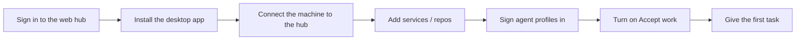

# Getting started

From having an account to an agent on your machine taking its first task. Vietnamese version: [../vi/getting-started.md](../vi/getting-started.md).

In this guide, `https://hub.example.com` stands for your team's hub address. Ask your hub admin for the real one.

## 1. Sign in to the web hub

1. Open the hub's address in a browser.
2. Pick one way:
   - **Account**: type *Username* and *Password*, press *Sign in*.
   - **SSO**: press *Sign in with <SSO name>* if the hub has it.
   - **Token**: press *Use an access token instead of an account* and paste the token an admin gave you.
   - **Invite link**: open the link an admin sent, fill in the form, press *Join*.
3. The first page is **Today**: what is waiting for you.

> Tip: pick a scope in the box at the top of the sidebar (a system or a service) so every page only shows that scope's data.

> A service is missing? A service you have no access to does not show at all. Ask the service lead or a hub admin for access.

### For admins: set up a new hub

1. On the server: clone the repo, run `docker compose up -d`, then `docker compose logs hub` to read the setup code.
2. Open `http://<server>:7788`. A hub with no account yet shows the **Set up the hub** page.
3. Fill in *Setup code*, *Admin account* (username, password twice), *Public hostname* or *LAN names / IPs*, and the options (files, memory search by meaning, SSO, backups).
4. Press *Save and restart*. The page moves on to sign-in.

Details (HTTPS, Cloudflare Tunnel, `HIVE_*` variables) are in the repository's root `README.md`, section *Hub cho team*.

## 2. Install the desktop app

1. Open https://github.com/tdduydev/xdev-hive/releases and pick the latest release.
2. Download the file for your operating system:
   - macOS: `xdev-hive-<version>-mac-<arch>.dmg`
   - Windows: the `.exe` installer
   - Linux: `.AppImage` or `.deb`
3. Install and open the app. From then on the app updates itself from the hub (see the app update section in [admin.md](admin.md)).

## 3. Connect the machine to the hub

On first run the app shows **Get started** with five steps: *Connection*, *Tools*, *Services*, *Agent accounts*, *Accept work*. Each step has a *Do now* button.

1. In the *Connection* step, type the *Hub URL* (for example `https://hub.example.com`).
2. Press *Sign in through the browser*. The browser opens the hub's page; sign in there and press *Allow*.
3. Go back to the app. *This machine* shows *The hub answers*.

Other ways (under *Other ways*): *Sign in with your hub password*, or *Paste a machine token* then *Connect with the token*.

> No hub needed? Pick *Use this machine on its own*. The data stays on the machine and every agent on it shares it. To move it to a hub later, use *Machine settings* › *Advanced* › *Data shared with the hub* › *Push this machine's data to the hub*.

To change or drop the connection later: **Machine settings** › *Connection* › *Change connection* / *Disconnect*.

## 4. Install the tools

1. Open **Tools & setup**. The app checks the agent CLIs, the `hive-mcp` command, Spec Kit and each repo's setup.
2. Press *Install everything missing*, or *Install* / *Install with npm* on a single row.
3. Row *Connect agents to Hive* (the `hive-mcp` command): if it shows *Add to PATH* (Windows), press it, then reopen your terminal.
4. Press *Check again* to confirm.

> Note: CLIs installed with npm need Node.js; Spec Kit needs `uv`.

## 5. Connect the machine's GitLab/GitHub

GitLab/GitHub tokens stay on the machine; the hub never holds them. The app uses them to read a group, fetch and pull repos, and open MRs/PRs.

1. Open **Machine settings** › the **GitLab/GitHub connection** card.
2. GitLab: type the GitLab URL and a token (scopes `api`, `write_repository`).
3. GitHub: type a fine-grained token with *Contents* and *Pull requests* (read and write) on the repos; add *Checks*, *Commit statuses* and *Actions* (read) to follow and fix CI.
4. Press *Save*, then *Check connection*. The card shows *Token set* and when it was last used.
5. To let the app open MRs/PRs: open the **Merge request / Pull request** card, turn on *Create MRs automatically*, pick *When*, then *Save*.

## 6. Add services (repos) to the machine

### Option A: one repo

1. **Tools & setup** › the **Services on this machine** card.
2. Press *Pick a folder…* (or type the path), change the project key if needed, press *Add service*.
3. A folder that holds several repos? The app lists each one with its *Target branch*; press *Add n services*. Turn on *Put them in system* to put them in one system.

> Warning: the folder must be a git repo. The app refuses a folder that is not.

### Option B: a whole GitLab group / GitHub owner

Once a token is set (step 5), **Tools & setup** shows the *Import a GitLab group* and *Import from GitHub* cards.

1. Type the *Group* (or *Organization or user* on GitHub), *Base folder*, *Clone over*.
2. Press *List repositories*. Each repo is marked *to clone*, *existing clone*, *a service already* or *folder conflict*.
3. Turn on *Put them in system* if you want, then press *Import n repositories*.

### Option C: link a system to a group

Use this when the system already exists on the hub and you want a new machine to have all its repos.

1. **Tools & setup** › the system's section › *Link a group*.
2. Pick the *Forge* (GitLab or GitHub), type the *Group*, press *Preview*. The app reports the matched services, the new repos, and the services that did not match (they stay in the system).
3. Press *Save source*.
4. On each machine: press *Set up the group on this machine*, pick the *Root folder* and *Clone over*, *Show plan*, then *Set up n repos*. Later, press *Sync now* when the group gets new repos.

### The "Repos here" screen

In each system on **Tools & setup**, the **Repos here** button opens a table of the system's repos on this machine: branch, against the remote (*↑n to push*, *↓n to pull*), changes, remote, access.

- *Fetch all*: asks each repo's remote, with the machine's token.
- *Pull* / *Pull all*: fast-forward only (`git pull --ff-only`).

> Pull skips a repo with uncommitted changes, a diverged branch, no upstream, or an agent at work, and says why. The app never merges or rebases for you.

## 7. Install the agent setup in each repo

1. **Tools & setup** › the service's card › *View items*.
2. On the agent setup row, press *Install into agents*. The app writes the `xdev-hive` MCP setup for Claude Code (`~/.claude.json`), Codex (`~/.codex/config.toml`) and Gemini, plus the hook that blocks hand edits of `AGENTS.md`.
3. If the repo's `.mcp.json` changed, commit it.
4. Press *Sync docs* on the **Services on this machine** card to write `AGENTS.md`, `CLAUDE.md` and `docs/decisions.md` from the hub into the repo.

> Quit Claude Code and Claude Desktop completely before pressing *Install into agents*: a running process can overwrite `~/.claude.json` when it exits.

## 8. Connect a coding agent through MCP

After step 7, open the CLI in the repo folder and check:

1. Claude Code: run `claude`, type `/mcp`. Expected: `xdev-hive` is *connected* and lists the `task_*`, `memory_*`, `doc_*` tools.
2. Codex: the setup lives in `~/.codex/config.toml` (a block with Hive's marker).
3. An agent without the desktop app (CI, a cloud machine): call `POST https://hub.example.com/mcp` with the header `Authorization: Bearer <token>`. Create the token from the account menu › *My tokens* › *Create token*; pick the *Read-only* role if the agent only needs to look things up.

> Never paste a token into a repo, a doc or memory.

Per-OS checks: [docs/mcp-check.md](../../mcp-check.md) (in Vietnamese).

## 9. Sign agent profiles in and accept work

1. Open **Agent profiles** › *Add a subscription*. Pick the account kind (*Claude account*, *ChatGPT (Codex) account*, …), pick how to sign in, press *Add and sign in*.
2. Follow the terminal or browser that opens. The profile's row turns *Ready*.
3. On the *Take work on this machine* card, turn intake on and set *At most at once*.

Details: [agents-and-quota.md](agents-and-quota.md).

## 10. Give the first task

1. On the web, press *+ New* › *Quick task*.
2. Type the *Description* and *Done when*, pick *Create and run*, leave *Choose an idle machine* or pick your machine.
3. Follow it on **Runs**. When the run is done, read the handoff and review the result.

Next: [tasks-and-runs.md](tasks-and-runs.md).
