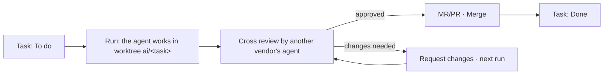

# Tasks and runs

Create tasks, give them to agents, follow runs and review the results. Vietnamese version: [../vi/tasks-and-runs.md](../vi/tasks-and-runs.md).

Rights needed: creating or editing tasks needs the service's *create/edit tasks* right; giving runs needs *dispatch/stop runs*; merging and passing reviews need *code review*. Buttons you have no right to do not show.

## Create a task

### Fastest: + New

1. Press *+ New* (⌘N) › *Quick task*.
2. Pick the service, type the *Description* and *Done when* (acceptance criteria).
3. Under *After creation*: *Create only*, or *Create and run*.
4. *Assigned agent (optional)*: leave *Choose an idle machine*, or pick a machine. The task ID is generated.

> Not sure how to do it yet? Pick *Ask the leader*. Work that needs a spec and a plan? Pick *New feature (full workflow)*.

### On the Tasks page

1. Open **Tasks**, pick a service in the scope picker.
2. Fill in *Task ID*, *Task title*, the dependencies (for example `T-1, T-2`), press *Create task*.
3. Switch views: *Kanban*, *Board* or *List*. Drag a card between columns to change its status.

### Dependencies

- In the *Depends on* column, press *Edit*, type the task IDs, *Save*.
- A task can depend on a task of another service in the same system (written `service/ID`).
- While a dependency is not *Done*, the task sits in *Blocked* and no agent can take it. It unlocks by itself once they are done.
- The *Ready next:* line suggests what to do first (the task that unlocks the most others).

## Give a task to an agent

Open the task panel (click a task). The ways:

| Way | When |
|---|---|
| *Run on a machine*: pick the *Machine*, open *Options* if needed, press *Run*. | Run it now on a given machine. |
| *Assigned agent* › *Assign to agent*. | Put the task in a machine's or profile's queue; it runs when its turn comes. |
| Pick several tasks › *Give to agents (n)*: set *Group name*, *At most in parallel*, *Send n tasks*. | Give a batch of tasks; the hub releases them as places free up. |
| *Prompt an agent*: *Task title*, *Prompt*, pick agents, *Send prompt*. Add several agents to compare results. | Small work with no task yet. |
| *Split a job*: *I write the parts* or *Ask an agent to split it*. | A large job split across several agents in parallel. |
| *Chain of roles*: add steps (role and instructions), *Run the n-step chain*. | Write code → write tests → review on the same branch. |

> A machine only takes runs when *Take work on this machine* is on in the app and it has the service's repo. A task with a platform (Windows, Linux, macOS) only goes to a machine of that platform.

While the hub has *Stop all agents* on for the service or the whole hub, no new run can be given until someone presses *Let agents run again*.

## Follow a run

1. Open **Runs**. Quick filters: *Needs attention*, *Running*, *Waiting for a machine*, *Waiting for you*, *Failed*, *Done*; *More filters* by group, task, machine.
2. Pick a run. Its page has:
   - *The run's steps*: *Read context → Write code → Run tests → Commit & MR* (a review run: *Read the diff → Check → Comment*).
   - The handoff: *DONE*, *NOT DONE*, *HOW TO VERIFY*, *RISKS*.
   - Tabs *Summary*, *Log*, *Changes · n* (diff), the MR/PR and its CI status.
3. A running run needs more instructions: type in *Message agent*, press *Send instructions*. The message waits for the machine, then reaches the run.
4. To stop it: *Cancel run* (running or waiting).

## Review the result

What waits for you shows on **Today** (*Needs your review*, *Needs your decision*). On the run's page:

1. Read the handoff and the review verdict (*Review: approved* / *Review: changes needed*).
2. Open *Changes* for the diff. *Risk flags* mark migrations, permissions, security, data deletion, large files.
3. Choose:
   - **Approved**: press *Merge* (the machine with the GitLab/GitHub token merges the MR/PR). A merged MR moves the task to *Done* when the service has that option on.
   - **The whole run needs changes**: *Request changes*, write *Instructions for the agent*, send. The agent continues on the same branch.
   - **A few places need changes**: in the diff, *Request changes* on each hunk, add a note, then *Queue fix (n notes)*.
4. A failed, timed-out or cancelled run: *Redispatch* to change the machine, *Change plan*, or *Continue on the existing branch*. *Run again* queues a new run of the same task.

> Nobody can approve their own work when the hub has the *Nobody approves their own* rule.

### Approve the plan before coding

If the service turned on *Approve the plan before coding* (*Medium / large tasks* or *Every task*), the agent writes a plan first:

1. The task shows *Awaiting plan approval* on **Today** and in the task panel (tab *Plan*).
2. Read the plan, press *Approve*, or *Revise plan* with *Plan revision notes*.
3. With *Auto-approve after (minutes)* set, the plan is approved when the time is up.

## Features and SDLC gates

Large work follows the Spec Kit flow on the **Features** page:

1. *+ New* › *New feature (full workflow)*, or **Features** › *New feature*: describe it, pick a machine. An agent writes `spec.md`.
2. At each step press *Plan it*, then *Break into tasks*.
3. Tab *Tasks* › *Import as tasks*: the lines of `tasks.md` become tasks, dependencies kept.
4. At each gate (Spec, Plan, Tasks, Review, Test, Merge…), someone with the right presses *Pass* or *Request changes*. Filter *Waiting for you* to see the gates waiting on you.

Which gates need a person, an AI check or nothing: **Pipeline** › *Process & models* (see [admin.md](admin.md)).

## Look back

- **Artifacts**: images, reports and files agents saved in runs.
- **History**: search runs, chat, SDLC gates and the audit; filter by *Task ID*, *Source*, dates.
- **Graph**: tasks and dependencies; the agent layer lets you drag and drop to assign tasks.
- Task panel › *Note history*: earlier handoffs, compare two versions in a row.
