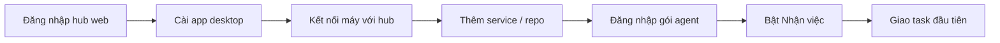

# Bắt đầu

Từ lúc có tài khoản đến khi agent trên máy bạn nhận task đầu tiên. Bản tiếng Anh: [../en/getting-started.md](../en/getting-started.md).

Trong hướng dẫn này, `https://hub.example.com` là địa chỉ hub của team bạn. Hỏi admin hub địa chỉ thật.

## 1. Đăng nhập hub web

1. Mở địa chỉ hub trên trình duyệt.
2. Chọn một cách:
   - **Tài khoản**: nhập *Tên đăng nhập* và *Mật khẩu*, bấm *Đăng nhập*.
   - **SSO**: bấm *Đăng nhập bằng <tên SSO>* nếu hub có bật.
   - **Token**: bấm *Dùng token truy cập thay cho tài khoản* và dán token admin đưa cho bạn.
   - **Link mời**: mở link admin gửi, điền thông tin, bấm *Tham gia*.
3. Trang đầu là **Hôm nay**: những việc đang chờ bạn.

> Mẹo: chọn phạm vi ở ô đầu thanh bên (một hệ thống hay một service) để mọi trang chỉ hiện dữ liệu của phạm vi đó.

> Bạn không thấy một service? Service chưa cấp quyền cho bạn thì hoàn toàn không hiện. Nhờ người quản lý service hay admin hub cấp quyền.

### Dành cho admin: dựng hub mới

1. Trên máy chủ: clone repo, chạy `docker compose up -d`, rồi `docker compose logs hub` để lấy mã cài đặt.
2. Mở `http://<máy chủ>:7788`. Hub chưa có tài khoản thì hiện trang **Cài đặt hub**.
3. Điền *Mã cài đặt*, *Tài khoản admin* (tên đăng nhập, mật khẩu hai lần), *Tên miền công khai* hoặc *Tên / IP trong LAN*, và các tuỳ chọn (lưu file, tìm memory theo nghĩa, SSO, backup).
4. Bấm *Lưu và khởi động lại*. Trang chuyển sang đăng nhập.

Chi tiết (HTTPS, Cloudflare Tunnel, biến `HIVE_*`) ở `README.md` gốc của repo, mục *Hub cho team*.

## 2. Cài app desktop

1. Mở https://github.com/tdduydev/xdev-hive/releases và chọn bản mới nhất.
2. Tải tệp cho hệ điều hành của bạn:
   - macOS: `xdev-hive-<phiên bản>-mac-<kiến trúc>.dmg`
   - Windows: tệp `.exe` (bộ cài)
   - Linux: `.AppImage` hoặc `.deb`
3. Cài và mở app. Từ đây app tự cập nhật từ hub (xem mục cập nhật app trong [admin.md](admin.md)).

## 3. Kết nối máy với hub

Lần đầu mở, app hiện trang **Bắt đầu** với năm bước: *Kết nối*, *Công cụ*, *Service*, *Gói agent*, *Nhận việc*. Mỗi bước có nút *Làm ngay*.

1. Ở bước *Kết nối*, nhập *URL hub* (ví dụ `https://hub.example.com`).
2. Bấm *Đăng nhập qua trình duyệt*. Trình duyệt mở trang hub; đăng nhập ở đó rồi bấm *Cho phép*.
3. Quay lại app. *Máy này* hiện *Hub trả lời bình thường*.

Cách khác (mục *Cách khác*): *Đăng nhập bằng mật khẩu hub*, hoặc *Dán token của máy* rồi *Kết nối bằng token*.

> Không cần hub? Chọn *Dùng một mình trên máy này*. Dữ liệu nằm trên máy, mọi agent trên máy đọc chung. Sau này muốn đưa lên hub thì dùng *Cài đặt máy* › *Nâng cao* › *Dữ liệu dùng chung với hub* › *Đẩy dữ liệu máy lên hub*.

Đổi hay ngắt kết nối sau này: **Cài đặt máy** › *Kết nối* › *Đổi kết nối* / *Ngắt kết nối*.

## 4. Cài công cụ

1. Mở **Công cụ & setup**. App tự kiểm CLI của agent, lệnh `hive-mcp`, Spec Kit và cấu hình từng repo.
2. Bấm *Cài hết những gì còn thiếu*, hoặc *Cài* / *Cài bằng npm* ở từng dòng.
3. Dòng *Kết nối agent với Hive* (lệnh `hive-mcp`): nếu hiện *Thêm vào PATH* (Windows) thì bấm, rồi mở lại terminal.
4. Bấm *Kiểm tra lại* để xác nhận.

> Lưu ý: CLI cài bằng npm cần Node.js; Spec Kit cần `uv`.

## 5. Kết nối GitLab/GitHub của máy

Token GitLab/GitHub nằm trên máy, hub không giữ. App dùng chúng để đọc group, fetch/pull repo, mở MR/PR.

1. Mở **Cài đặt máy** › thẻ **Kết nối GitLab/GitHub**.
2. GitLab: nhập URL GitLab và token (scope `api`, `write_repository`).
3. GitHub: nhập token fine-grained có *Contents* và *Pull requests* (đọc và ghi) trên các repo; thêm *Checks*, *Commit statuses*, *Actions* (đọc) nếu muốn theo dõi và sửa CI.
4. Bấm *Lưu*, rồi *Kiểm tra kết nối*. Thẻ hiện *Đã có token* và lần dùng cuối.
5. Muốn app tự mở MR/PR: mở thẻ **Merge request / Pull request**, bật *Tự tạo MR*, chọn *Khi nào*, rồi *Lưu*.

## 6. Thêm service (repo) vào máy

### Cách A: một repo

1. **Công cụ & setup** › thẻ **Service trên máy này**.
2. Bấm *Chọn thư mục…* (hoặc gõ đường dẫn), sửa project key nếu cần, bấm *Thêm service*.
3. Thư mục chứa nhiều repo? App liệt kê từng repo con với *Nhánh đích*; bấm *Thêm n service*. Bật *Gom vào hệ thống* để đưa chúng vào cùng một hệ thống.

> Cảnh báo: thư mục phải là git repo. Thư mục không phải git thì app từ chối.

### Cách B: cả group GitLab / GitHub

Khi đã có token (bước 5), **Công cụ & setup** có thẻ *Nhập từ group GitLab* và *Nhập từ GitHub*.

1. Nhập *Group* (hoặc *Organization hoặc user* với GitHub), *Thư mục gốc*, *Clone qua*.
2. Bấm *Liệt kê repo*. Mỗi repo có nhãn *sẽ clone*, *dùng clone có sẵn*, *đã là service* hoặc *thư mục xung đột*.
3. Bật *Gom vào hệ thống* nếu muốn, rồi bấm *Nhập n repo*.

### Cách C: liên kết một hệ thống với group

Dùng khi hệ thống đã có trên hub và bạn muốn máy mới có đủ repo của nó.

1. **Công cụ & setup** › phần của hệ thống › *Liên kết group*.
2. Chọn *Nơi lưu repo* (GitLab hay GitHub), nhập *Group*, bấm *Xem trước*. App báo số service khớp, repo mới, và service không khớp (vẫn giữ trong hệ thống).
3. Bấm *Lưu nguồn*.
4. Trên mỗi máy: bấm *Init group trên máy này*, chọn *Thư mục gốc* và *Giao thức clone*, *Xem kế hoạch*, rồi *Init n repo*. Về sau bấm *Đồng bộ ngay* khi group có repo mới.

### Màn hình "Repo trên máy"

Ở mỗi hệ thống trên **Công cụ & setup**, nút **Repo trên máy** mở bảng các repo của hệ thống trên máy này: branch, so với remote (*↑n chưa push*, *↓n cần pull*), thay đổi, remote, quyền truy cập.

- *Fetch tất cả*: hỏi remote của từng repo bằng token của máy.
- *Pull* / *Pull tất cả*: chỉ fast-forward (`git pull --ff-only`).

> Pull bỏ qua repo có thay đổi chưa commit, branch đã rẽ nhánh, không có upstream, hoặc đang có agent làm việc, và ghi lý do. App không bao giờ merge hay rebase thay bạn.

## 7. Cài cấu hình agent cho từng repo

1. **Công cụ & setup** › thẻ của service › *Xem từng mục*.
2. Ở dòng cấu hình agent, bấm *Cài vào agents*. App ghi cấu hình MCP `xdev-hive` cho Claude Code (`~/.claude.json`), Codex (`~/.codex/config.toml`), Gemini, và hook chặn sửa tay `AGENTS.md`.
3. Nếu `.mcp.json` của repo đổi, commit nó.
4. Bấm *Đồng bộ tài liệu* ở thẻ **Service trên máy này** để ghi `AGENTS.md`, `CLAUDE.md`, `docs/decisions.md` từ hub vào repo.

> Đóng hẳn Claude Code và Claude Desktop trước khi bấm *Cài vào agents*: tiến trình đang chạy có thể ghi đè `~/.claude.json` khi thoát.

## 8. Kết nối coding agent qua MCP

Sau bước 7, mở CLI trong thư mục repo và kiểm:

1. Claude Code: chạy `claude`, gõ `/mcp`. Mong đợi: `xdev-hive` ở trạng thái *connected* và có các tool `task_*`, `memory_*`, `doc_*`.
2. Codex: cấu hình nằm trong `~/.codex/config.toml` (khối có marker của Hive).
3. Agent không có app desktop (CI, máy cloud): gọi thẳng `POST https://hub.example.com/mcp` với header `Authorization: Bearer <token>`. Tạo token ở menu tài khoản › *Token của tôi* › *Tạo token*; chọn vai *Chỉ đọc* nếu agent chỉ cần tra cứu.

> Không dán token vào repo, tài liệu hay memory.

Hướng dẫn kiểm từng hệ điều hành: [docs/mcp-check.md](../../mcp-check.md).

## 9. Đăng nhập gói agent và bật nhận việc

1. Mở **Gói agent** › *Thêm gói*. Chọn loại tài khoản (*Tài khoản Claude*, *Tài khoản ChatGPT (Codex)*, …), chọn cách đăng nhập, bấm *Thêm và đăng nhập*.
2. Làm theo terminal hay trình duyệt mở ra. Dòng gói chuyển *Sẵn sàng*.
3. Ở thẻ *Nhận việc trên máy này*, bật nhận việc và đặt *Tối đa cùng lúc*.

Chi tiết: [agents-and-quota.md](agents-and-quota.md).

## 10. Giao task đầu tiên

1. Trên web, bấm *+ Mới* › *Giao việc nhanh*.
2. Nhập *Mô tả* và *Xong khi*, chọn *Tạo và chạy*, để *Tự chọn máy rảnh* hoặc chọn máy của bạn.
3. Theo dõi ở **Lượt chạy**. Khi run xong, đọc bàn giao và review kết quả.

Tiếp theo: [tasks-and-runs.md](tasks-and-runs.md).
