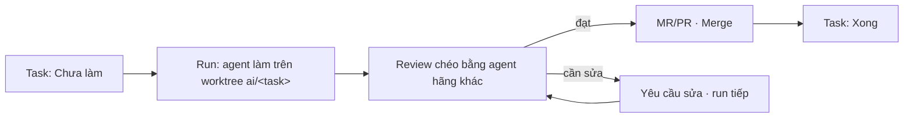

# Task và lượt chạy

Tạo task, giao cho agent, theo dõi run và duyệt kết quả. Bản tiếng Anh: [../en/tasks-and-runs.md](../en/tasks-and-runs.md).

Quyền cần có: tạo/sửa task cần quyền *tạo/sửa task* của service; giao run cần quyền *giao/dừng run*; merge và duyệt review cần quyền *review code*. Nút bạn không có quyền sẽ không hiện.

## Tạo task

### Nhanh nhất: + Mới

1. Bấm *+ Mới* (⌘N) › *Giao việc nhanh*.
2. Chọn service, nhập *Mô tả* và *Xong khi* (tiêu chí xong).
3. Ở *Sau khi tạo*: *Chỉ tạo*, hoặc *Tạo và chạy*.
4. *Agent phụ trách (tuỳ chọn)*: để *Tự chọn máy rảnh*, hoặc chọn một máy. Mã task được tự sinh.

> Việc chưa rõ cách làm thì chọn *Hỏi leader*. Việc cần spec và kế hoạch thì chọn *Tính năng mới (đầy đủ)*.

### Trên trang Task

1. Mở **Task**, chọn một service ở ô phạm vi.
2. Điền *Mã task*, *Tiêu đề task*, *phụ thuộc* (ví dụ `T-1, T-2`), bấm *Tạo task*.
3. Đổi cách xem: *Kanban*, *Board* hoặc *Danh sách*. Kéo thẻ giữa các cột để đổi trạng thái.

### Phụ thuộc

- Ở cột *Phụ thuộc*, bấm *Sửa*, nhập mã task, *Lưu*.
- Task có thể phụ thuộc task của service khác trong cùng hệ thống (ghi `service/mã`).
- Còn task phụ thuộc chưa *Xong* thì task nằm *Bị chặn*, agent không nhận được. Xong hết thì tự mở khoá.
- Dòng *Sẵn sàng tiếp theo* gợi ý task nên làm trước (mở khoá được nhiều task khác nhất).

## Giao task cho agent

Mở panel task (bấm vào một task). Có các cách:

| Cách | Khi nào dùng |
|---|---|
| *Chạy trên máy*: chọn *Máy*, mở *Tuỳ chọn* nếu cần, bấm *Chạy*. | Muốn chạy ngay trên một máy cụ thể. |
| *Agent phụ trách* › *Gán cho agent*. | Xếp task vào hàng của một máy/gói; task chạy khi đến lượt. |
| Chọn nhiều task › *Giao cho agent (n)*: đặt *Tên đợt*, *Chạy song song tối đa*, *Gửi n task*. | Giao một loạt task, hub thả dần khi có chỗ. |
| *Prompt cho agent*: *Tiêu đề task*, *Prompt*, chọn agent, *Gửi prompt*. Thêm nhiều agent để so sánh kết quả. | Việc nhỏ chưa có task. |
| *Chia việc*: *Tôi viết danh sách việc con* hoặc *Nhờ agent chia*. | Việc lớn chia cho nhiều agent song song. |
| *Chuỗi vai*: thêm các bước (vai và chỉ dẫn), *Chạy chuỗi n bước*. | Viết code → viết test → review trên cùng branch. |

> Máy chỉ nhận run khi đã bật *Nhận việc trên máy này* trong app và có repo của service. Task có nền tảng (Windows, Linux, macOS) chỉ đi tới máy đúng nền tảng.

Khi hub đang *Dừng mọi agent* cho service hay cả hub, không giao được run mới cho tới khi có người bấm *Cho agent chạy lại*.

## Theo dõi run

1. Mở **Lượt chạy**. Lọc nhanh: *Cần theo dõi*, *Đang chạy*, *Chờ máy*, *Chờ người*, *Lỗi*, *Xong*; *Lọc thêm* theo đợt, task, máy.
2. Chọn một run. Trang run có:
   - *Các bước của run*: *Đọc context → Viết code → Chạy test → Commit và MR* (run review: *Đọc diff → Kiểm tra → Nhận xét*).
   - Bàn giao: *ĐÃ LÀM*, *CHƯA LÀM*, *CÁCH KIỂM*, *RỦI RO*.
   - Tab *Tóm tắt*, *Log*, *Thay đổi · n* (diff), MR/PR và trạng thái CI.
3. Run đang chạy mà cần thêm chỉ dẫn: gõ vào *Nhắn agent*, bấm *Gửi chỉ dẫn*. Tin chờ máy nhận rồi được giao cho run.
4. Muốn dừng: *Huỷ run* (run đang chạy hoặc đang chờ).

## Duyệt kết quả

Việc chờ bạn hiện ở **Hôm nay** (*Cần bạn review*, *Cần bạn quyết*). Trên trang run:

1. Đọc bàn giao và kết luận review (*Review: đạt* / *Review: cần sửa*).
2. Mở *Thay đổi* để xem diff. *Cờ rủi ro* đánh dấu migration, quyền, bảo mật, xoá dữ liệu, file lớn.
3. Chọn một hướng:
   - **Đạt**: bấm *Merge* (máy có token GitLab/GitHub sẽ merge MR/PR). MR merge thì task tự sang *Xong* nếu service bật tuỳ chọn đó.
   - **Cần sửa toàn run**: *Yêu cầu sửa*, viết *Chỉ dẫn gửi agent*, gửi. Agent làm tiếp trên cùng branch.
   - **Cần sửa vài chỗ**: trong diff, *Yêu cầu sửa* ở từng hunk, ghi chú, rồi *Xếp lượt sửa (n ghi chú)*.
4. Run lỗi, hết giờ hay bị huỷ: *Giao lại* để đổi máy, *Đổi gói*, hoặc *Làm tiếp trên branch hiện có*. *Chạy lại* xếp run mới cho cùng task.

> Không ai tự duyệt việc của chính mình khi hub bật luật *Không ai được tự duyệt*.

### Duyệt kế hoạch trước khi code

Nếu service bật *Duyệt kế hoạch trước khi code* (*Task cỡ m/l* hoặc *Mọi task*), agent viết kế hoạch trước:

1. Task hiện *Chờ duyệt kế hoạch* ở **Hôm nay** và panel task (tab *Kế hoạch*).
2. Đọc kế hoạch, bấm *Duyệt*, hoặc *Sửa kế hoạch* kèm *Ghi chú sửa kế hoạch*.
3. Nếu đặt *Tự duyệt sau (phút)*, kế hoạch tự được duyệt khi hết hạn.

## Tính năng và chốt SDLC

Việc lớn đi theo luồng Spec Kit trên trang **Tính năng**:

1. *+ Mới* › *Tính năng mới (đầy đủ)*, hoặc **Tính năng** › *Tính năng mới*: mô tả, chọn máy. Agent viết `spec.md`.
2. Ở mỗi bước bấm *Lập kế hoạch*, rồi *Chia việc*.
3. Tab *Tasks* › *Nhập thành task*: các dòng `tasks.md` thành task, giữ phụ thuộc.
4. Tại mỗi chốt (Spec, Plan, Tasks, Review, Kiểm thử, Merge…), người có quyền bấm *Cho qua* hoặc *Yêu cầu sửa*. Lọc *Chờ bạn* để thấy chốt đang chờ mình.

Chốt nào cần người, chốt nào AI kiểm hay tự động: **Quy trình** › *Quy trình & model* (xem [admin.md](admin.md)).

## Xem lại

- **Artifact**: ảnh, báo cáo, tệp agent lưu trong run.
- **Lịch sử**: tìm nội dung trong run, chat, chốt SDLC, nhật ký; lọc theo *Mã task*, *Nguồn*, ngày.
- **Sơ đồ**: task và phụ thuộc; lớp agent cho phép kéo thả để gán task.
- Panel task › *Lịch sử ghi chú*: các bản bàn giao trước, so sánh hai bản liền nhau.
